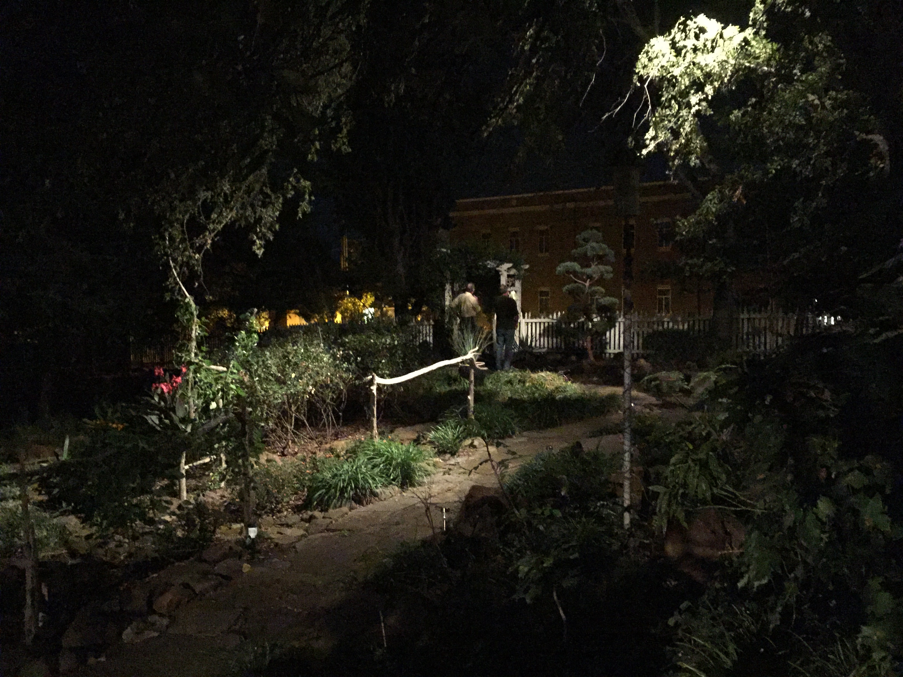

# markdown-conversion-test

## Second Header

### Images

Remote image:


Local image:



## Code Snippets

Code snippets `should` render as code, including HTML elements like `<p>`, `<body>`, `<html>`, etc..

Also, stand along less than or greater than symbols should display correct: `Class > Module`, `Module < Class`, `C -> M`

```rb
array << 'ruby shovel syntax should render correctly on this line'
```

```sh
git clone git@github.com:<this-contentt-should-appear>/<even-though-these-are-wrapped-like-html>
```

__This should be italicized__. **This should be bolded**. In a code snippet, or code block 
these should be escaped

```js
this.innerText = "this should render as code"

this.__proto__ //should render as two underscores before and after proto, not italicized
```

```
This is an unlabelled code snippet
```

<h1>This should render as a big header, not </h1>

<iframe />

```html
<h1>This should not render as a header, but as an h1 code snippet</h1>
```

> Block quotes should render as a group
> On multiple lines
> Here

